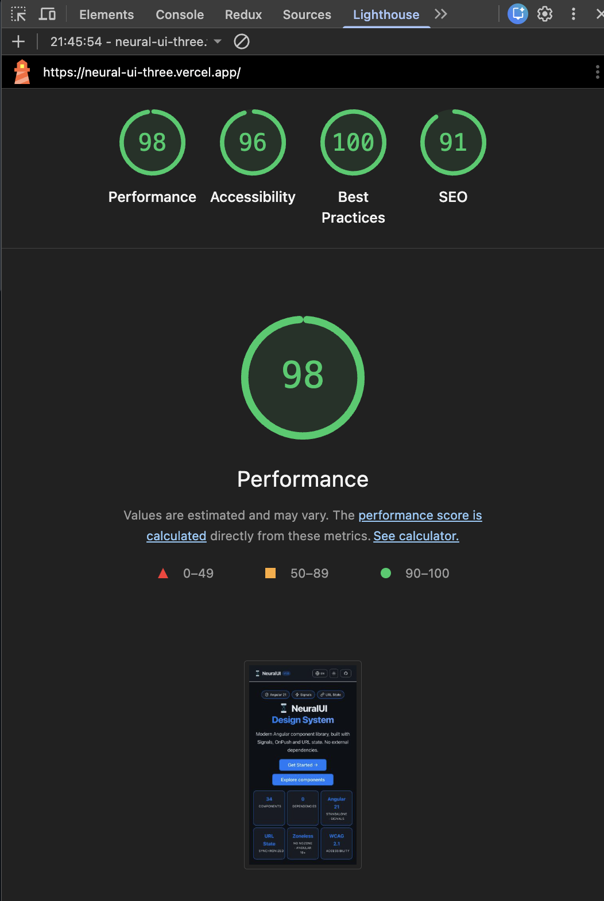

# @neural-ui/core

<p>
  <a href="https://www.npmjs.com/package/@neural-ui/core"></a>
  <a href="https://www.npmjs.com/package/@neural-ui/core"></a>
  
  
  
  
</p>

Modern Angular UI component library — **signals-first**, fully **standalone**, with dedicated subpath entry points and no Zone.js requirement.

> Live documentation and examples → [neural-ui-three.vercel.app](https://neural-ui-three.vercel.app)

> Building a full admin product? Try [Neural Admin Pro](https://neural-ui-admin-pro.vercel.app/login), a premium Angular dashboard template built with Neural UI and ready to connect to your own backend.

<p align="center">
  
</p>

---

## Features

- **50+ entry points** — components, overlays, data display primitives, utilities, and styles
- **Signals API** — inputs, outputs and internal state are built with `input()`, `output()`, `signal()`, `computed()` and `effect()`
- **Standalone** — every component is standalone, import only what you need
- **OnPush everywhere** — maximum performance out of the box
- **Accessible by design** — ARIA attributes, keyboard navigation and focus management across the main interactive components
- **Well-tested** — 1615+ passing tests with 96.75% statements coverage, 95.67% branch coverage and 94.98% function coverage
- **Themeable** — full design token system via CSS custom properties

---

## Quality Snapshot

- Signals-first architecture across `ui-core`
- Standalone + OnPush component model
- BEM as the required styling convention for component and demo SCSS
- Zoneless-oriented test setup
- Global coverage above 90% in all main metrics and across covered `ui-core` source files
- Strong accessibility baseline validated in showcase and reinforced in core components

For the current quality checklist and accessibility audit snapshot, see [projects/ui-core/QUALITY_STATUS.md](projects/ui-core/QUALITY_STATUS.md).

---

## Installation

```bash
npm install @neural-ui/core @angular/cdk @ng-icons/core @ng-icons/lucide apexcharts ng-apexcharts
```

---

## Setup

Add `provideNeuralUI()` to your `app.config.ts`:

```typescript
import { ApplicationConfig } from '@angular/core';
import { provideRouter } from '@angular/router';
import { provideNeuralUI } from '@neural-ui/core';

export const appConfig: ApplicationConfig = {
  providers: [provideRouter(routes), provideNeuralUI()],
};
```

Import the global stylesheet in your `styles.scss`:

```scss
@use '@neural-ui/core/styles' as *;
```

Component APIs are imported from dedicated subpaths. The package root is reserved for setup utilities such as `provideNeuralUI()`.

```typescript
import { NeuButtonComponent } from '@neural-ui/core/button';
import { NeuInputComponent } from '@neural-ui/core/input';
import { NeuTableComponent } from '@neural-ui/core/table';
import { NeuToastService } from '@neural-ui/core/toast';
```

---

## Usage

Import any component directly into your standalone component:

```typescript
import { FormControl, ReactiveFormsModule } from '@angular/forms';
import { NeuButtonComponent } from '@neural-ui/core/button';
import { NeuInputComponent } from '@neural-ui/core/input';

@Component({
  imports: [NeuButtonComponent, NeuInputComponent, ReactiveFormsModule],
  template: `
    <neu-input label="Email" type="email" [formControl]="email" />
    <neu-button variant="primary" (click)="submit()">Send</neu-button>
  `,
})
export class LoginComponent {
  email = new FormControl('');
}
```

---

## Components

Representative entry points in 1.5.0:

- **Forms**: `@neural-ui/core/input`, `@neural-ui/core/select`, `@neural-ui/core/multiselect`, `@neural-ui/core/autocomplete`, `@neural-ui/core/date-input`, `@neural-ui/core/number-input`, `@neural-ui/core/input-otp`
- **Navigation and layout**: `@neural-ui/core/tabs`, `@neural-ui/core/nav`, `@neural-ui/core/sidebar`, `@neural-ui/core/accordion`, `@neural-ui/core/toolbar`, `@neural-ui/core/dashboard-grid`
- **Data and overlays**: `@neural-ui/core/table`, `@neural-ui/core/tree`, `@neural-ui/core/tree-table`, `@neural-ui/core/modal`, `@neural-ui/core/popover`, `@neural-ui/core/context-menu`, `@neural-ui/core/command-palette`, `@neural-ui/core/virtual-list`, `@neural-ui/core/confirm-dialog`
- **Rich data display**: `@neural-ui/core/kanban`, `@neural-ui/core/timeline-grid`, `@neural-ui/core/image-gallery`, `@neural-ui/core/uploader`
- **Feedback and utilities**: `@neural-ui/core/alert`, `@neural-ui/core/toast`, `@neural-ui/core/tooltip`, `@neural-ui/core/block-ui`, `@neural-ui/core/url-state`
- **Visualization and display**: `@neural-ui/core/chart`, `@neural-ui/core/stats-card`, `@neural-ui/core/timeline`, `@neural-ui/core/meter-group`, `@neural-ui/core/knob`

For the complete catalog, examples, and API tables, use the live docs at [neural-ui-three.vercel.app](https://neural-ui-three.vercel.app).

---

## Neural Admin Pro

Build production-ready SaaS dashboards, CRM tools, internal business apps and client portals with Neural Admin Pro, a premium Angular dashboard template built with Neural UI.

Neural Admin Pro is frontend-only and backend-ready, so you can connect it to your own API, Firebase, Supabase, Laravel, NestJS, Django, Rails or any custom backend.

- [Live demo](https://neural-ui-admin-pro.vercel.app/login)
- [Buy on Gumroad](https://trujillopete.gumroad.com/l/epbrur)
- [Buy on Payhip](https://payhip.com/b/0apB6)
- [Buy on Lemon Squeezy](https://pedromorenostordeve.lemonsqueezy.com/checkout/buy/52e743fd-bb93-4ce7-ae17-c8bf2718de3c)

### Highlights in 1.5.0

- New components: `NeuTreeComponent`, `NeuTreeTableComponent`, `NeuTimelineGridComponent`, `NeuKanbanComponent`, `NeuImageGalleryComponent`, `NeuUploaderComponent`.
- `NeuUploaderComponent` — drag-and-drop file upload with type/size/duplicate validation, progress tracking and fully configurable i18n labels.
- `NeuTreeComponent` and `NeuTreeTableComponent` — hierarchical data display with keyboard navigation, single/multi-selection and lazy loading support.
- Dark mode fix: uploader dropzone and error state backgrounds now use `color-mix()` over CSS tokens instead of hardcoded `rgba` values.
- `NeuAutocompleteComponent` supports virtual scroll for large result sets.
- `@neural-ui/core/modal` includes `NeuDialogService` for programmatic dialogs.

---

## Peer dependencies

| Package            | Required version   |
| ------------------ | ------------------ |
| `@angular/core`    | `>=19.0.0 <23.0.0` |
| `@angular/cdk`     | `>=19.0.0 <23.0.0` |
| `@angular/common`  | `>=19.0.0 <23.0.0` |
| `@angular/forms`   | `>=19.0.0 <23.0.0` |
| `@angular/router`  | `>=19.0.0 <23.0.0` |
| `@ng-icons/core`   | `>=31.4.0 <34.0.0` |
| `@ng-icons/lucide` | `>=31.4.0 <34.0.0` |
| `apexcharts`       | `>=4.0.0 <6.0.0`   |
| `ng-apexcharts`    | `>=1.15.0 <3.0.0`  |

For Angular 19 projects, use `ng-apexcharts@1.15.x` with `apexcharts@4.x` or newer. Angular 20+ projects can use the newer `ng-apexcharts@2.x` line.

---

## Contributing

1. Fork the repository and create a feature branch
2. Run `npm install`
3. Run tests: `npm test`
4. Run the release gate: `npm run verify:release`
5. Open a pull request

---

## Known issues & workarounds

### Angular 20.x — npm peer resolution on install

**Affected versions:** Angular 20.x projects with mixed Angular/CDK minors  
**Symptom:** `npm install` may fail with `ERESOLVE` or peer dependency conflicts while installing `@neural-ui/core` and its required peers.

**Root cause:** Angular 20.x is supported, but installation can fail when `@angular/*` packages and `@angular/cdk` are not aligned to the same minor version in the host app.

**Solution — align Angular packages before installing:**

Make sure all Angular packages, especially `@angular/cdk`, use the same 20.x minor in your app, then reinstall dependencies.

```bash
npm install @angular/core@20.x @angular/common@20.x @angular/forms@20.x @angular/router@20.x @angular/cdk@20.x
npm install @neural-ui/core @ng-icons/core @ng-icons/lucide apexcharts ng-apexcharts
```

### Angular 21.2.x — NG3004 with `FormsModule`

**Affected versions:** Angular 21.2.0 – 21.2.7  
**Symptom:** Using `FormsModule` (even standalone imports) in any component causes the build error:

```
NG3004: NeuXxx is not a known element... ɵNgNoValidate is not exported from the types definition file
```

**Root cause:** `ɵNgNoValidate` is accidentally not `export`ed from `@angular/forms/types/forms.d.ts` in those patch releases.

**Solution — use `ReactiveFormsModule` + `FormControl`:**

Replace every template-driven value binding with a `FormControl` + `[formControl]` directive:

```typescript
// Before (triggers NG3004)
import { FormsModule } from '@angular/forms';
// ...
imports: ([FormsModule],
  // ...
  (isChecked = false));
```

```typescript
// After (works correctly)
import { FormControl, ReactiveFormsModule } from '@angular/forms';
// ...
imports: [ReactiveFormsModule],
// ...
readonly isChecked = new FormControl(false, { nonNullable: true });
```

```html
<!-- Before -->
<neu-checkbox [value]="isChecked" (valueChange)="isChecked = $event" label="Accept" />

<!-- After -->
<neu-checkbox [formControl]="isChecked" label="Accept" />
```

All NeuralUI form components implement `ControlValueAccessor` (`NG_VALUE_ACCESSOR`) and work with both binding strategies. Prefer `ReactiveFormsModule` for Angular 21+.

---

## License

MIT © [Pedro Moreno Trujillo](https://github.com/PedroMorenoTrujillo)
